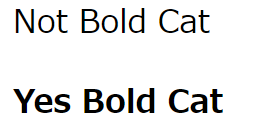

<button type="button" onclick="history.back()">戻る</button>


# < b > < /b >
bタグはBold(太い)の意味である。表示結果からもわかるようにbタグは< /b>で閉じなくともbタグが先頭にある行は一つの見出しになる。
表記を意味するタグ。

記述例 [](変更しない)

```
<body>
    <p> Not Bold Cat
    <b> Yes Bold Cat
</body>
```

表示結果　[](変更しない)


