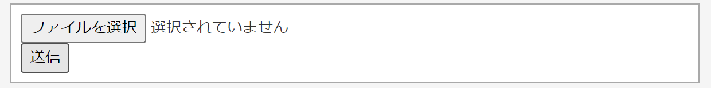
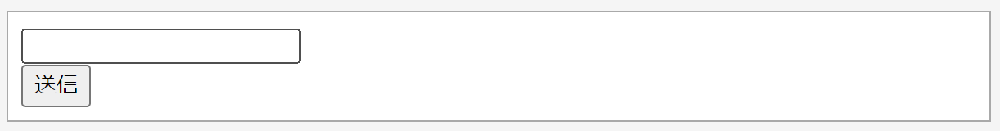
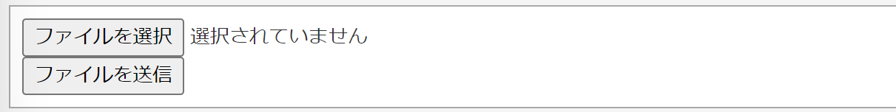

<button type="button" onclick="window.location.href='https://b2211590.github.io/kaitaishinsho/command/nano'">ファイルを保存して終了する方法（nano）</button>

# < form > < /form >

入力・送信フォームを作成する際に使用するタグ。フォームのデータをどこに送信するのか、どのように送信するのかを指定する。


  記述例 [](変更しない)
  
  ```
  <form method="post" action="URLを指定">
    <input type="text" name="変数名"> 
    <input type="submit"> 
  </form>
  ```
  ＊記述例では大文字で書いているが小文字でも良い。

### 使用できるタグ一覧

- **inputタグ**

  フォームのパーツを作成するためのタグ。type属性を設定することで、テキストを入力するのか、データを送信するのかなどを指定できる。

  | 要素 | 内容 |
  | :---: | :---: |
  |type="text"|テキスト入力欄を作成|
  |type="file"|ファイル選択を作成|
  |type="submit"|送信ボタンを作成|

  記述例.1　[](変更しない)

  ```
  <form method="post" action="URLを指定" enctype="multipart/form-data">
    <input type="file" >
    <br>
    <input type="submit">
  </form>
  ```
  この例では、actionで指定したURLにINPUTのfileの値を送信している。
  また、`type="file"` と指定した時には必ず `ENCtype="multipart/form-data"` をformタグの中に書かなければならない。
  <br>

  実行結果.1　[](変更しない)
  
  <br>


  記述例.2　[](変更しない)

  ```
  <form method="post" action="URLを指定">
    <input type="text" >
    <br>  <!-- <br>は改行 -->
    <input type="submit">
  </form>
  ```
  この例では、actionで指定したURLにINPUTのtextの値を送信している。
  <br>

  実行結果.2　[](変更しない)
  
  <br>


### 属性一覧


- **action属性**
  
  formタグ内で指定する属性。データを送信する先(URL)を指定する。

  記述例 [](変更しない)
  
  ```
  <form action="URLを指定">
  ```

- **method属性** 
  
  formタグ内で指定する属性。
  フォームのデータをどのように送信するか指定する。
  指定できる要素にpostとgetがある。

  | 要素 | 内容 |
  | :---: | :---: |
  | post | フォームで入力されたデータをサーバに送信する |
  | get | 何か情報を検索したり取得するときに使う |
  
  記述例　[](変更しない)
  
  ```
  <form method="post" action="URLを指定">
  ```


  


- **name属性** 
    
  inputタグ内で指定する属性。フォームの見た目には影響しないが、データがどの記入欄に対応しているのかをサーバ側で把握できるようになる。
  
  実行例　[](変更しない)
  
  ```
  <form method="post" action="URLを指定">
    <input type="text" name="username"> 
    <br>
    <input type="submit" > 
  </form>
  ```
  この例ではmethodをpostで指定し、actionで指定されたURLにINPUTのtext値を変数（キー）"username"に格納して送信している。


  実行結果　[](変更しない)
  
  <br>

- **value属性** 
  
  inputタグ内で指定する属性。value="文字列"のように指定すると、記入欄の場合は初期値を設定、ボタンの場合はボタンに文字を記入できる。
  
  
  実行例　[](変更しない)
  
  ```
  <form method="post" action="URLを指定">
    <input type="file" name="file"> 
    <br>
    <input type="submit" value="ファイルを送信"> 
  </form>
  ```


  実行結果　[](変更しない)
  


