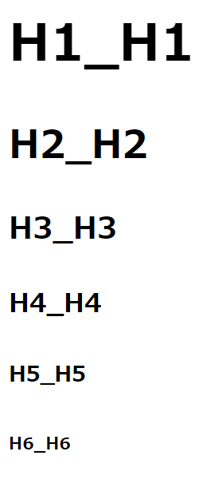

<button type="button" onclick="history.back()">戻る</button>

# < h1~6 > < /h1~6 >
hタグはheading(見出し)の意味である。表示結果からもわかるようにhタグは< /h>で閉じなくともhタグが先頭にある行は一つの見出しになる。
構造と表記を意味するタグ。

記述例 [](変更しない)

```
<body>
    <h1>h1_h1</h1>
    <h2>h2_h2
    <h3>h3_h3
    <h4>h4_h4
    <h5>h5_h5</h5>
    <h6>h6_h6</h6>
</body>
```

表示結果 [](変更しない)


