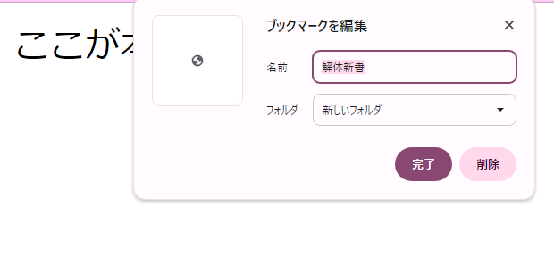

<button type="button" onclick="history.back()">戻る</button>

# < head > < /head >
HTML のヘッド部は < head > 要素の内容である。ヘッド部の内容はページには表示されない。その代わり、ヘッド部の仕事は文書のメタデータを含んでいる。メタデータとはデータを説明するためのデータである。
構造を意味するタグ。

  記述例 [](変更しない)
  
  ```
   <head>
    <meta charset="utf-8">　<!--日本語と認識できるように指定-->
    <title>解体新書</title>
   </head>
  ```


### タグ一覧


- **< title >**
  
  この文書のタイトルを指定する。
  HTML文書のヘッダ部に<b>一度だけ</b>記述する。タイトルは、ブラウザのツールバー、履歴、検索エンジンの検索結果などの表示で反映される。
  HTMLタグ、headタグ、bodyタグは省略可能だが、titleタグだけは省略することができない。
  タイトルに日本語を用いる場合は、先にmetaタグで文字コードの指定を行っておくことが推奨されている。
  <br>
  
  記述例 [](変更しない)
  
  ```
   <head>
    <meta charset="utf-8"> <!--日本語と認識できるように指定-->
    <title>解体新書</title>
   </head>
   <body>
    ここが本文新書
   </body>
  ```
  <br>
  <br>

  <b>実行結果</b>

  

  <br>
  
- **< meta >**
  
  HTML文書内で使用される特殊なタグであり、メタデータ（文書に関する情報）を指定するため用いる。
  
  
  #### 属性一覧

  
  - **文字セット charset**
    
    HTML文書の文字エンコーディングを指定する。一般的な値はUTF-8である。
    前述にもあるようにtitleに非ASCII文字(日本語等)を用いている場合はtitleタグの前に記述する必要がある。
    
    記述例 [](変更しない)
    
    ```
    <meta charset="UTF-8"> ※ASCII+日本語
    <meta charset="Shift_JIS"> ※日本語
    <meta charset="ISO-8859-1"> ※ラテン文字
    ```
  - **アプリケーション名 name="application-name"**
    
    Webアプリケーション名を指定するが、Webアプリケーションではない通常ページの場合には指定してはいけない。
    
    記述例 [](変更しない)
    
    ```
    <meta name="application-name" content="KaitaiSinsho">
    ```
  - **筆者名 author="author"**
    
    HTML文書の著者を明記する。画面上では表示の変化はない。
    
    記述例 [](変更しない)
    
    ```
    <meta name="author" content="Fukachan">
    ```
