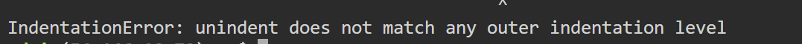

<button type="button" onclick="window.location.href='https://b2211590.github.io/kaitaishinsho/command/nano'">ファイルを保存して終了する方法（nano）</button>

# www.py の編集で気をつけること

`www.py` を編集して Rekognition を使えるようにするとき、次の二点に気をつけること。

1. **インデントでタブを使わない**
2. **uploadメソッドの編集後でインデントのレベルを確認する**

 

### 1. インデントでタブを使わない

Python ではタブキー(tab)を使ってインデントのレベルを調整できるが、今回の演習環境では使用できない。

タブを使用すると次のようなエラーが起きてしまう。

`www.py` では**半角スペース3つ**でインデントのレベルを調整しているので、それと同じ方法で調整すること。

 

### 2. uploadメソッドの編集後でインデントのレベルを確認する

ただ追記やコピペをするだけではインデントのレベルがずれてしまうので、上にある通りの方法でインデントを調整すること。

次のようなエラーが起きた場合はインデントがずれているため、
エラー文で言及されている箇所のインデントを確認すること。

※これはエラー文の全てではないので自分のエラー文をよく見ること。