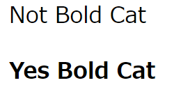

[](ファイル名はコマンド名.md)
# < B > < /B >
BタグはBold(太い)の意味である。表示結果からもわかるようにBタグは< /B>で閉じなくともBタグが先頭にある行は一つの見出しになる。
表記を意味するタグ。

記述例 [](変更しない)

```
<BODY>
    <P> Not Bold Cat
    <B> Yes Bold Cat
</BODY>
```

表示結果　[](変更しない)


