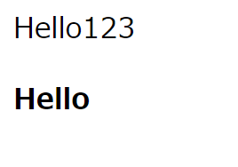

<h3><a href="https://b2211590.github.io/kaitaishinsho/html/html_top"><B>topへ戻る</B></a></h3>

# < BODY > < /BODY >
構造を意味するタグ、文書の本文であることを表す。テキスト、画像、リンク、動画などを明記的にメインコンテンツのために使用されるタグである。bodyタグ内に書かれたコンテンツは、実際にブラウザ上で表示される。

記述例 [](変更しない)
  
  ```
    <BODY>
    <p>Hello123</p>
    <B> Hello </B>
    </BODY>
  ```
表示結果　[](変更しない)


