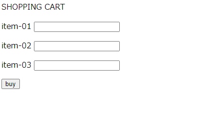

[](ファイル名はコマンド名.md)
# HTML
HTML（HyperText Markup Language）は、ウェブページを作成するための標準的なマークアップ言語である。HTMLは、テキストベースの文書を構造化し、コンテンツを表示するための<b>タグ</b>を使用する。
タグは< hoge >から< /hoge >までを一つのブロックと見なす。
<b>そのため大文字/小文字の区別や空白や改行も無視される</b>。

記述例 [](変更しない)
  
  ```
<!-- saved from url=(0035)http://api.fml.org/dist/lsform.html -->
<html>
    <head><meta http-equiv="Content-Type" content="text/html; charset=UTF-8"></head>
    <body>
        <p>SHOPPING CART</p>
        <form method="POST" action="http://api.fml.org/api/lsform/v1">
            <p>item-01<input name="item-01" type="text"></p>
            <p>item-02<input name="item-02" type="text"></p>
            <p>item-03<input name="item-03" type="text"></p>
            <p><input type="submit" value="buy"></p>
        </form>
    </body>
</html>
  ```

表示結果　[](変更しない)



### タグ一覧

<font size="5">[B](b.md)</font>太文字
<font size="5">[BODY](b.md)</font>メインコンテンツ
<font size="5">[FORM](form.md)</font>情報を送ることができる
<font size="5">[H](h.md)</font>見出し
<font size="5">[HEAD](head.md)</font>ヘッダー情報
<font size="5">[HTML](html.md)</font>HTML文と指定する
<font size="5">[P](p.md)</font>一つの段落、文章
