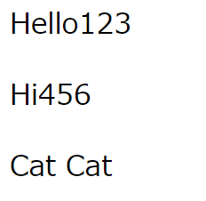

<h3><a href="https://b2211590.github.io/kaitaishinsho/html/html_top"><B>topへ戻る</B></a></h3>

# < P > < /P >
PタグはParagraph(段落)という意味である。pタグは< /p>で閉じなくともpタグが先頭にある行は一つの段落になる。
構造を意味するタグ。

記述例 [](変更しない)

```
<BODY>
<p>Hello123</p>
<p>Hi456
<p>Cat Cat
</BODY>
```

表示結果　[](変更しない)


